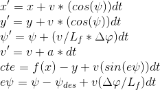

# CarND-Controls-MPC
Self-Driving Car Engineer Nanodegree Program

---

## Description:

In this project instead of a PID controller a technique of [Model Predictive Control](https://en.wikipedia.org/wiki/Model_predictive_control)
 is being used, in this case the result is much better than the obtained with a PID controller.
 
The Processing flow is roughly as follows:

The simulator provides 6 points which are the route to follow:
 

 

The Model of the vehicle is as follows, it's only a kinematic model:
 

 

The simulator provides with the next states: 
`x`: The position x relative to the map. 
`y`: The position y relative to the map. 
`v`: The current speed of te vehicle. 
`psi`: The current steering angle. 
`epsi`: The error between desired psi and current. 

### Parameters:

As in other projects there are parameters that can/must be tunned to improve performance.
 #### `N` and `dt`
 This pair of parameters define the number of steps that the optimizer takes.
 The bigger the N and smaller the dt more points are taked to find an optimal curve.
 
#### Penalization paramters

This parameters are multiplicative factors to **artificially** increase the effect of certain variable of the 
constraint equation, in this case penalty factors for steering and acceleration are added. 
The factors are:
* Steering: 40
* Throttle: 10

### Delay in model

In this project a delay of 100 ms is added, this models the actual delay between sensor-processing-actuator response.
This causes that the data we are measuring and for which we are calculating a response is already in the past, for this
we need to predict the value that the car and the cross track error will have. To solve this situation the control action
sent to the car is the action for the next state and not for the current one, also this delay is taken into account 
in the `solve` procedure that minimizes the time between activations.

## Dependencies

* cmake >= 3.5
* make >= 4.1
* gcc/g++ >= 5.4
* [uWebSockets](https://github.com/uWebSockets/uWebSockets) == 0.14, but the master branch will probably work just fine
  * Follow the instructions in the [uWebSockets README](https://github.com/uWebSockets/uWebSockets/blob/master/README.md) to get setup for your platform. You can download the zip of the appropriate version from the [releases page](https://github.com/uWebSockets/uWebSockets/releases). Here's a link to the [v0.14 zip](https://github.com/uWebSockets/uWebSockets/archive/v0.14.0.zip).
* [Ipopt](https://projects.coin-or.org/Ipopt)
  * Linux
    * You will need a version of Ipopt 3.12.1 or higher. The version available through `apt-get` is 3.11.x. If you can get that version to work great but if not there's a script `install_ipopt.sh` that will install Ipopt. You just need to download the source from the Ipopt [releases page](https://www.coin-or.org/download/source/Ipopt/) or the [Github releases](https://github.com/coin-or/Ipopt/releases) page.
    * Then call (For Fedora) `MPC_Quizzes/my_ipopt.sh` as root. 
* [CppAD](https://www.coin-or.org/CppAD/)
  * Linux `sudo apt-get install cppad` or equivalent.
* [Eigen](http://eigen.tuxfamily.org/index.php?title=Main_Page). This is already part of the repo so you shouldn't have to worry about it.

## Basic Build Instructions

1. Clone this repo.
2. Make a build directory: `mkdir build && cd build`
3. Compile: `cmake .. && make`
4. Run it: `./mpc`.

